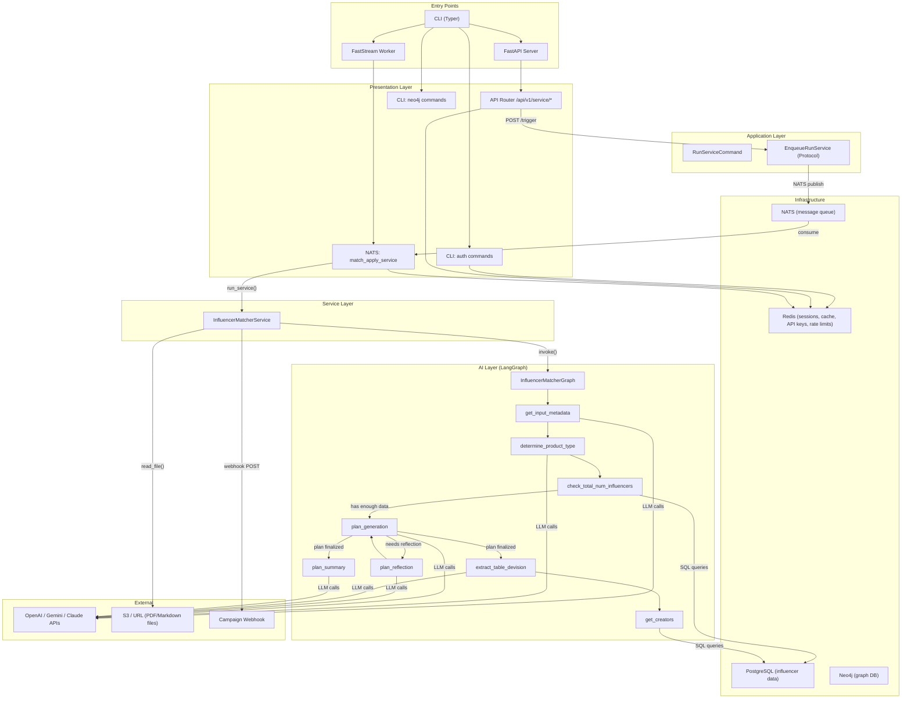
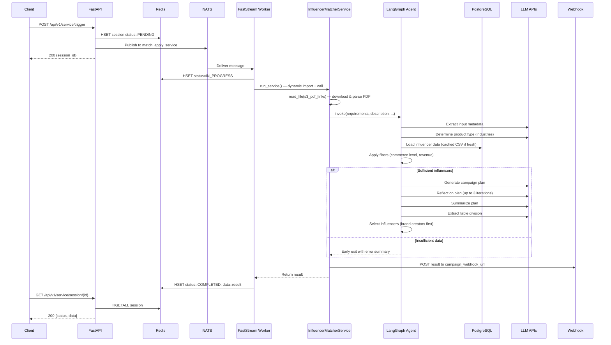
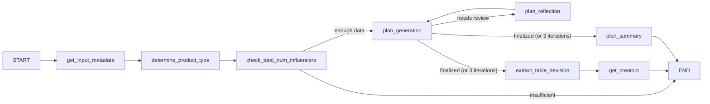

# Fluence Match

## 1. High-Level Overview

**Fluence Match** is an **influencer matching platform** built as a Python 3.12 backend system. It accepts campaign briefs (PDFs/Markdown), uses AI (OpenAI, Gemini, Claude via LangGraph) to analyze requirements, queries a PostgreSQL database of influencer data, generates budget-optimized campaign plans, selects matching influencers, and delivers results via webhooks.

| Attribute | Value |
|---|---|
| **Language** | Python 3.12 |
| **Package Manager** | Poetry |
| **API Framework** | FastAPI + Uvicorn |
| **Worker Framework** | FastStream (NATS) |
| **CLI Framework** | Typer (custom [AsyncTyper](file:///c:/Users/hiept/Documents/Workspace/fluence-match/match/core/async_typer.py#10-34)) |
| **DI Container** | Dishka |
| **Databases** | PostgreSQL (SQLAlchemy Async), Neo4j (Neomodel), Redis |
| **Message Queue** | NATS JetStream |
| **AI/LLM Stack** | LangChain, LangGraph, LiteLLM, LlamaIndex |
| **Containerization** | Docker + Docker Compose |

---

## 2. Architecture Diagram



> **Architecture Style**: **Event-driven layered architecture** — an API triggers async tasks via NATS, consumed by a worker that orchestrates an AI agent pipeline and delivers results via webhooks.

---

## 3. Project Structure

```
fluence-match/
├── manage.py                    # Alt entry point
├── pyproject.toml               # Poetry config, CLI script definition
├── Dockerfile                   # Multi-stage Docker build
├── docker-compose.yml           # API + Worker + Redis + NATS
├── entrypoint.sh                # Docker entrypoint (API or Worker mode)
├── Makefile                     # Dev shortcuts
├── .env.example                 # Environment template
├── match/                       # Main Python package
│   ├── main/                    # Bootstrap layer (entry points)
│   │   ├── cli/                 # CLI factory + Typer app
│   │   ├── api/                 # FastAPI factory + native runner
│   │   └── worker/              # FastStream factory + native runner
│   ├── config/                  # Settings (pydantic-settings)
│   ├── presentation/            # Request handlers
│   │   ├── api/                 # FastAPI routes (/api/v1/service/*)
│   │   ├── cli/                 # CLI commands (auth, neo4j)
│   │   └── worker/              # NATS consumer handler
│   ├── application/             # Commands + abstractions
│   │   ├── commands/            # RunServiceCommand (Pydantic)
│   │   └── common/              # Protocols (EnqueueRunService)
│   ├── services/                # Business logic
│   │   └── influencer_matching  # Core matching service
│   ├── ai_model/                # AI agent
│   │   └── agent/
│   │       ├── core/            # Prompts, tools, postprocessing
│   │       └── influencer_matcher_agent/  # LangGraph graph
│   ├── models/                  # Domain models (Neo4j Neomodel)
│   ├── schemas/                 # Pydantic schemas & enums
│   ├── infrastructure/          # Technical implementations
│   │   ├── api_key_manager/     # API key creation + encryption
│   │   ├── persistence/         # NATS client + task queue adapter
│   │   └── rate_limit.py        # Redis Lua rate limiter
│   ├── processor/               # File reading (PDF, Markdown)
│   ├── providers/               # Dishka DI providers
│   │   └── factory/             # LLM factory protocol
│   ├── core/                    # Cross-cutting concerns
│   │   ├── async_typer.py       # Async Typer subclass
│   │   ├── logging.py           # Loguru config
│   │   ├── decorators/          # cache_api decorator
│   │   ├── dependencies/        # FastAPI auth dependency
│   │   └── task/                # Dynamic service runner
│   ├── utils/                   # Helpers
│   └── api/                     # Standalone routes
│       └── delete_cache.py      # CSV cache cleanup
└── scripts/                     # Dev scripts (format, lint)
```

---

## 4. Execution Workflow

### 4.1 Startup Flow

````carousel
### CLI Bootstrap
```
manage.py / `poetry run match`
  → CLIFactory.make()
    → get_settings()           # loads .env via pydantic-settings
    → make_container(settings) # builds Dishka DI container (9 providers)
    → neo4j_driver_config()    # configures neomodel
    → creates AsyncTyper app with commands: api, worker, auth, neo4j
```
<!-- slide -->
### API Mode (`match api`)
```
CLIFactory → run_api(settings, container, port)
  → APIFactory.make()
    → FastAPI(lifespan=lifespan)
    → setup_dishka(container, app)
    → include_router(router)        # /api/v1/service/*
    → include_router(delete_cache)  # /delete_table_cache
  → uvicorn.run(app, host, port)
```
<!-- slide -->
### Worker Mode (`match worker`)
```
CLIFactory → run_worker(settings, container)
  → WorkerFactory.make()
    → NatsBroker(servers=nats_url)
    → broker.include_router(router) # match_apply_service
    → FastStream(broker)
    → setup_dishka(container, app)
  → asyncio.run(app.run())
```
````

### 4.2 Request Processing Flow



### 4.3 Key Point: Dynamic Service Invocation

The worker uses a **reflection-based service runner** ([service.py](file:///c:/Users/hiept/Documents/Workspace/fluence-match/match/core/task/service.py)):

1. [RunServiceCommand](file:///c:/Users/hiept/Documents/Workspace/fluence-match/match/application/commands/run_service.py#6-23) formats the service name (e.g., `"influencer_matching.InfluencerMatcherService"`)
2. [import_string()](file:///c:/Users/hiept/Documents/Workspace/fluence-match/match/utils/module_loading.py#17-31) dynamically imports the class
3. Dishka container resolves the instance with all dependencies
4. Parameters are validated via Pydantic/TypeAdapter introspection
5. The target method is called (sync or async)

---

## 5. Dependency Injection (Dishka Container)

The DI container is assembled in [providers/factory/\_\_init\_\_.py](file:///c:/Users/hiept/Documents/Workspace/fluence-match/match/providers/factory/__init__.py) with **9 providers**:

| Provider | Scope | What it provides |
|---|---|---|
| [ConfigsProvider](file:///c:/Users/hiept/Documents/Workspace/fluence-match/match/providers/configs.py#6-18) | APP | [Settings](file:///c:/Users/hiept/Documents/Workspace/fluence-match/match/config/settings.py#12-77) instance |
| [ConnectionsProvider](file:///c:/Users/hiept/Documents/Workspace/fluence-match/match/providers/connections.py#14-63) | APP/REQUEST | Redis pool, NATS client, OpenAI client, SQLAlchemy session |
| [LLMProvider](file:///c:/Users/hiept/Documents/Workspace/fluence-match/match/providers/llm.py#19-53) | APP/REQUEST | [ChatOpenAI](file:///c:/Users/hiept/Documents/Workspace/fluence-match/match/providers/factory/llm.py#7-19), `ChatGoogleGenerativeAI`, `ChatAnthropic`, [ChatOpenAIFactory](file:///c:/Users/hiept/Documents/Workspace/fluence-match/match/providers/factory/llm.py#7-19) |
| [EmbeddingsProvider](file:///c:/Users/hiept/Documents/Workspace/fluence-match/match/providers/embeddings.py#7-14) | APP | `OpenAIEmbeddings` |
| [ComputersProvider](file:///c:/Users/hiept/Documents/Workspace/fluence-match/match/providers/computers.py#7-16) | APP | [EncryptComputer](file:///c:/Users/hiept/Documents/Workspace/fluence-match/match/infrastructure/api_key_manager/encrypt_computer.py#4-13) (Fernet) |
| [ManagersProvider](file:///c:/Users/hiept/Documents/Workspace/fluence-match/match/providers/managers.py#9-29) | REQUEST | [APIKeyManager](file:///c:/Users/hiept/Documents/Workspace/fluence-match/match/infrastructure/api_key_manager/api_key_manager.py#14-57), [RateLimitManager](file:///c:/Users/hiept/Documents/Workspace/fluence-match/match/infrastructure/rate_limit.py#8-76) |
| [TaskQueueAdaptersProvider](file:///c:/Users/hiept/Documents/Workspace/fluence-match/match/providers/task_queue.py#7-14) | APP | [EnqueueRunService](file:///c:/Users/hiept/Documents/Workspace/fluence-match/match/application/common/task_queue/run_service.py#4-11) → [EnqueueRunServiceWithNats](file:///c:/Users/hiept/Documents/Workspace/fluence-match/match/infrastructure/persistence/nats/task_queue/run_service.py#7-15) |
| [ServicesProvider](file:///c:/Users/hiept/Documents/Workspace/fluence-match/match/providers/services.py#9-20) | REQUEST | [InfluencerMatcherService](file:///c:/Users/hiept/Documents/Workspace/fluence-match/match/services/influencer_matching.py#18-146) |
| [AgentProvider](file:///c:/Users/hiept/Documents/Workspace/fluence-match/match/providers/agent.py#10-32) | APP | [InfluencerMatcherGraph](file:///c:/Users/hiept/Documents/Workspace/fluence-match/match/ai_model/agent/influencer_matcher_agent/graph.py#25-104) |

---

## 6. AI Agent Deep Dive — InfluencerMatcherGraph

The core intelligence is a **LangGraph StateGraph** defined in [graph.py](file:///c:/Users/hiept/Documents/Workspace/fluence-match/match/ai_model/agent/influencer_matcher_agent/graph.py):

### 6.1 Graph Nodes

| Node | Function | LLM? | Responsibility |
|---|---|---|---|
| [get_input_metadata](file:///c:/Users/hiept/Documents/Workspace/fluence-match/match/ai_model/agent/influencer_matcher_agent/nodes.py#294-316) | Extract budget, KOC count, product info from text | OpenAI | Structured extraction → [UserQueryExtraction](file:///c:/Users/hiept/Documents/Workspace/fluence-match/match/ai_model/agent/influencer_matcher_agent/structured_output.py#117-127) |
| [determine_product_type](file:///c:/Users/hiept/Documents/Workspace/fluence-match/match/ai_model/agent/influencer_matcher_agent/nodes.py#32-64) | Classify into allowed industries | OpenAI | Structured extraction → [RelevantIndustries](file:///c:/Users/hiept/Documents/Workspace/fluence-match/match/ai_model/agent/influencer_matcher_agent/structured_output.py#10-17) |
| [check_total_num_influencers](file:///c:/Users/hiept/Documents/Workspace/fluence-match/match/ai_model/agent/influencer_matcher_agent/nodes.py#66-95) | Query PostgreSQL for matching influencers | ❌ | Uses [InfluencerStats](file:///c:/Users/hiept/Documents/Workspace/fluence-match/match/ai_model/agent/core/tools/matching_influencer/check_availability.py#41-398) tool; loads & caches data |
| [plan_generation](file:///c:/Users/hiept/Documents/Workspace/fluence-match/match/ai_model/agent/influencer_matcher_agent/nodes.py#97-146) | Create an influencer campaign plan | OpenAI | Iterative plan with budget allocation |
| [plan_reflection](file:///c:/Users/hiept/Documents/Workspace/fluence-match/match/ai_model/agent/influencer_matcher_agent/nodes.py#148-189) | Critique the generated plan | OpenAI | Provides feedback for plan improvement |
| [plan_summary](file:///c:/Users/hiept/Documents/Workspace/fluence-match/match/ai_model/agent/influencer_matcher_agent/nodes.py#318-333) | Summarize the final plan | OpenAI | Human-readable summary |
| [extract_table_devision](file:///c:/Users/hiept/Documents/Workspace/fluence-match/match/ai_model/agent/influencer_matcher_agent/nodes.py#191-221) | Parse plan into segment allocations | OpenAI | → [TableDevisionPlan](file:///c:/Users/hiept/Documents/Workspace/fluence-match/match/ai_model/agent/influencer_matcher_agent/structured_output.py#69-105) (segments w/ price estimates) |
| `get_creators` | Select influencer records from DataFrame | ❌ | Prioritizes brand creators, sorts by seller/revenue |

### 6.2 Graph Flow



### 6.3 Data Pipeline (InfluencerStats Tool)

The [check_total_num_influencers](file:///c:/Users/hiept/Documents/Workspace/fluence-match/match/ai_model/agent/influencer_matcher_agent/nodes.py#66-95) node loads influencer data from **PostgreSQL** using an 1-hour CSV cache strategy:

1. **Tables loaded**: `creators`, `content_categories`, `creator_content_categories`, `ecommerce_product_categories`, `creator_product_categories`, `creator_revenues`
2. **Merges**: Creator metadata ← revenue aggregation ← content categories ← product categories
3. **Filters applied** via [FilterContainer](file:///c:/Users/hiept/Documents/Workspace/fluence-match/match/ai_model/agent/core/postprocessing/filtering/filter_container.py#9-31): `CommerceUserLevelFilter` (excludes PERSONAL), `RevenueFilter5Min2Month`
4. **Result**: A merged DataFrame with [id](file:///c:/Users/hiept/Documents/Workspace/fluence-match/match/providers/llm.py#19-53), `unique_id`, `nickname`, [signature](file:///c:/Users/hiept/Documents/Workspace/fluence-match/match/utils/func.py#5-15), `total_followers`, `seller_id`, `revenue`, `main_category`
5. **Industry filtering**: Filters by `main_category` intersection with determined industries
6. **Brand creators**: Optionally loads via `creator_partnered_brands` JOIN

---

## 7. Technology Justification

| Technology | Why Used | Problem Solved | Trade-offs |
|---|---|---|---|
| **FastAPI** | Modern async Python API framework | High-performance REST API with auto-docs | Heavier than Flask, but async-native |
| **FastStream + NATS** | Async message consumer framework | Decouples API from heavy AI processing | NATS is lightweight vs Kafka but has fewer features |
| **Dishka** | Typed DI container for Python | Clean dependency management across API/Worker/CLI | Less ecosystem adoption than dependency-injector |
| **LangChain + LangGraph** | LLM orchestration framework | Multi-step AI agent with state, reflection loops | Framework overhead; rapid API changes |
| **Redis** | In-memory K/V store | Session tracking, API caching, API key storage, rate limiting | Single point of failure for session state |
| **Neo4j (Neomodel)** | Graph database + ORM | Influencer relationship modeling | Only used for schema management (CLI commands), not in main flow |
| **PostgreSQL (asyncpg)** | Relational database | Bulk influencer data storage with complex joins | Used as the primary data source for the AI pipeline |
| **Typer (AsyncTyper)** | CLI framework | Unified entry point for API/Worker/Admin commands | Custom [AsyncTyper](file:///c:/Users/hiept/Documents/Workspace/fluence-match/match/core/async_typer.py#10-34) needed to support async commands |
| **Pydantic** | Data validation | Request/response schemas, settings management | Pervasive but necessary for type safety |
| **Fernet (cryptography)** | Symmetric encryption | API key encryption at rest in Redis | Simple but adequate for API key protection |
| **Pandas** | Data manipulation | Influencer data filtering, segmentation, selection | Memory-intensive for large datasets |
| **aiohttp** | Async HTTP client | File downloads from S3 URLs + webhook delivery | Duplicates some httpx/requests functionality |

---

## 8. Module Deep Dives

### 8.1 `match.config` — Settings Management
- [settings.py](file:///c:/Users/hiept/Documents/Workspace/fluence-match/match/config/settings.py): `pydantic-settings` `BaseSettings` with `.env` file support, env vars, and sensible defaults for all services (Redis, NATS, OpenAI, Gemini, Claude, PostgreSQL, Neo4j).

### 8.2 `match.core` — Cross-Cutting Concerns
- [async_typer.py](file:///c:/Users/hiept/Documents/Workspace/fluence-match/match/core/async_typer.py): Wraps Typer to support `async def` command handlers via `asyncio.run()`
- [cache_api.py](file:///c:/Users/hiept/Documents/Workspace/fluence-match/match/core/decorators/cache_api.py): Redis-backed HTTP response caching decorator with SHA-256 key hashing, TTL, and `Cache-Control: no-store` bypass
- [authentication.py](file:///c:/Users/hiept/Documents/Workspace/fluence-match/match/core/dependencies/authentication.py): Two-tier rate limiting — per-API-key global limits + per-endpoint limits, using Redis Lua scripts
- [service.py](file:///c:/Users/hiept/Documents/Workspace/fluence-match/match/core/task/service.py): Reflection-based service runner — dynamically imports service classes, resolves via DI, validates params via Pydantic introspection

### 8.3 `match.infrastructure` — Technical Implementations
- **API Key Manager**: Creates URL-safe tokens (`match_*`), encrypts with Fernet, stores hash→encrypted mapping in Redis with TTL. Verification hashes incoming key and looks up in Redis.
- **Rate Limiter**: Uses a Lua script for atomic Redis check-and-increment with expiry. Supports MINUTE/HOUR/DAY/WEEK/MONTH/YEAR windows.
- **NATS Client + Task Queue**: Custom [NatsClient](file:///c:/Users/hiept/Documents/Workspace/fluence-match/match/infrastructure/persistence/nats/client.py#6-34) wrapper with reconnect settings. [EnqueueRunServiceWithNats](file:///c:/Users/hiept/Documents/Workspace/fluence-match/match/infrastructure/persistence/nats/task_queue/run_service.py#7-15) publishes [RunServiceCommand](file:///c:/Users/hiept/Documents/Workspace/fluence-match/match/application/commands/run_service.py#6-23) to `match_apply_service` topic.

### 8.4 `match.processor` — File Processing
- [file_reader.py](file:///c:/Users/hiept/Documents/Workspace/fluence-match/match/processor/file_reader.py): Factory pattern supporting PDF (via `PyPDFLoader`) and Markdown (via `UnstructuredMarkdownLoader`). Downloads URLs to temp files, auto-detects format via extension/MIME/magic bytes, supports batch processing.

### 8.5 `match.services` — Business Logic
- [influencer_matching.py](file:///c:/Users/hiept/Documents/Workspace/fluence-match/match/services/influencer_matching.py): Orchestrates the full pipeline: PDF reading → AI graph invocation → result building (input metadata, plan, table division, influencer list, debug info) → webhook delivery via [post_campaign_result()](file:///c:/Users/hiept/Documents/Workspace/fluence-match/match/utils/post_to_api.py#7-34).

### 8.6 `match.models` — Domain Models
- [base.py](file:///c:/Users/hiept/Documents/Workspace/fluence-match/match/models/base.py): Abstract Neo4j node with UUID and timestamp
- [influencer.py](file:///c:/Users/hiept/Documents/Workspace/fluence-match/match/models/influencer.py): Neo4j [Influencer](file:///c:/Users/hiept/Documents/Workspace/fluence-match/match/models/influencer.py#6-23) node (uid, unique_id, nickname, region, followers, videos, etc.)
- [influencer_matcher.py](file:///c:/Users/hiept/Documents/Workspace/fluence-match/match/models/influencer_matcher.py): Pydantic models for request input (`campaign_id`, `s3_pdf_links`), response output, and structured extraction results

---

## 9. Key Insights & Potential Improvements

> [!NOTE]
> These are observations from the code review — they are suggestions, not criticisms.

### Strengths
- **Clean layered architecture** with clear separation of concerns (presentation → application → service → infrastructure)
- **Factory pattern** throughout (CLI, API, Worker factories) enables consistent bootstrap
- **Dishka DI** provides excellent testability and dependency management
- **LangGraph** agent with reflection loop (plan generation → critique → refinement) is sophisticated
- **Multi-LLM support** (OpenAI, Gemini, Claude) with easy swappability
- **Redis Lua rate limiting** is atomic and production-grade

### Areas for Improvement

| Area | Observation | Suggestion |
|---|---|---|
| **Neo4j Usage** | Neo4j models exist but the main pipeline uses PostgreSQL exclusively | Clarify Neo4j's role or consolidate to one DB |
| **CSV Caching** | Data is cached as CSV files on disk with 1-hour TTL | Consider Redis-based DataFrame caching for ephemeral environments |
| **Error Handling** | Some `traceback.print_exc()` calls bypass structured logging | Use `logger.exception()` consistently |
| **Testing** | No test files found in the repository | Add unit tests for services, integration tests for the graph |
| **Type Safety** | Some `__dict__` assignments bypass Pydantic validation in [InfluencerStats](file:///c:/Users/hiept/Documents/Workspace/fluence-match/match/ai_model/agent/core/tools/matching_influencer/check_availability.py#41-398) | Refactor to use proper model fields or `model_post_init` |
| **SQL Injection Risk** | `f"SELECT {select_clause} FROM {table_name}"` uses string interpolation | Use parameterized queries or a query builder |
| **Hardcoded Vietnamese** | Error messages in [conditional_edge.py](file:///c:/Users/hiept/Documents/Workspace/fluence-match/match/ai_model/agent/influencer_matcher_agent/conditional_edge.py) are in Vietnamese | Externalize to i18n or configuration |
| **Dev Dependencies** | `ruff`, `black`, `mypy`, `pre-commit` are in main dependencies | Move to `[tool.poetry.group.dev.dependencies]` |
| **State Mutation** | Some nodes mutate state directly (e.g., `state["rec_plan_summary"] = ...`) | Follow LangGraph convention of returning state updates only |
